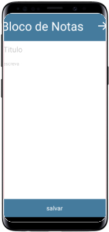
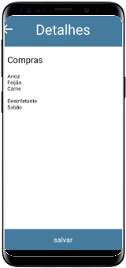

# NotePad
<div style="display:flex">
    <div style="text-align:center;"></div>
    <div style="text-align:center"></div>
    <div style="text-align:center"></div>
</div>

Aplicação mobile de bloco de notas simples

## Funcionalidades
* Criar posts
* Listar posts
* vê e edita-los

## Instalação
````js
npm install
yarn
````

## Execução
````
npm start
yarn start
````

## Author

Lucas Ribeiro [lucasNetwork](https://github.com/lucasnetwork)

